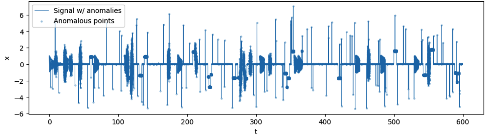
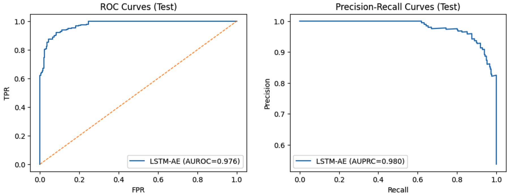
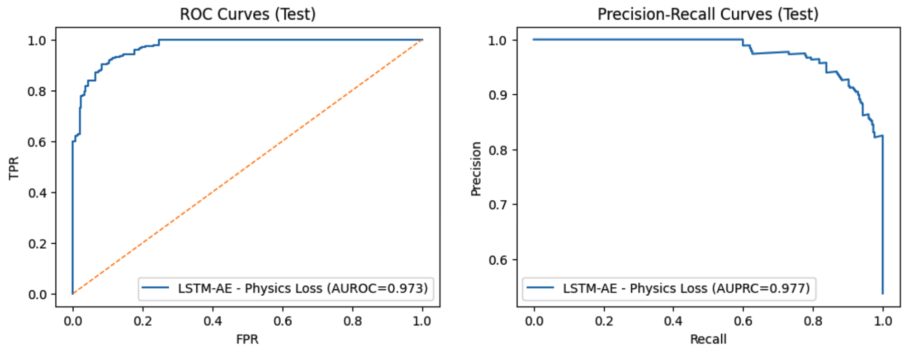




# LSTM Autoencoder for Anomaly Detection on Damped Oscillator Dataset - MSE loss vs Physics-Informed loss

## Abstract
Anomalies are data points that deviate from normal behaviour. They can occur in a variety of contexts: economics, cybersecurity, manufacturing, robotics and many others. Detecting anomalies is a fundamental task to prevent potential financial consequences, information loss and damage to systems or people. In this project, I study **reconstruction-based Anomaly Detection** on simulated **damped harmonic oscillator** data training an **LSTM Autoencoder**, comparing traditional **mean squared error (MSE) loss** to a **Physics-informed loss** that embeds the system's dynamics equation. Normal data is simulated from a noisy underdamped harmonic oscillator. Anomalies (spikes, level shifts, frequency shifts and variance bursts) are inserted and labelled at window level after overlapping segmentation (128-size window, stride 32) and standardization. The baseline LSTM Autoencoder is first trained with MSE loss. Afterwards it is trained with a total loss that sums MSE and an ODE residual that embeds the damped oscillator equation, encouraging reconstructions with physical knowledge. The two models are evaluated via **F1-maximizing reconstruction-error thresholding** and **Youden J. criterion** on validation data. On test data, both models present strong performance with **97.6% AUROC and 98.0% AUPRC**. **Physics-informed loss improves F1 score, compared to MSE loss, from 90.2% to 91.3%**, demonstrating better sensitivity to anomalies thanks to its dynamics knowledge. 

## Introduction
When studying the behaviour of **dynamical systems**, it's fundamental to be able to robustly analyze **time series data** and understand temporal dependencies and constraints imposed by dynamical equations. With the right tools it is possible to detect anomalies in time series data and potentially prevent failures and flag sensor faults and regime shifts. In this project I use an LSTM Autoencoder to learn the **manifold** of normal dynamics and flag as anomalous temporal windows with high reconstruction error. I then compare conventional training with **MSE loss** to a **Physics informed loss** that augments MSE with the **damped oscillator differential equation**. 

An **LSTM (Long Short-Term Memory)** is a **recurrent neural network (RNN)** architecture designed to model **sequential data with long-range dependencies**. Information flow through time is controlled by its **gates: Input, Forget and Output**, allowing the model to conserve or remove information and context as needed. Its architecture is suited especially suited for:
- forecasting and filtering time-sequential signals
- learning dynamics in noisy settings measured in timesteps
- compressing high dimensional data (encoding) into compact lower-dimensional latent representation and understand normal behaviour

In a **reconstruction-based anomaly detection** setup, an LSTM Autoencoder is trained to reconstruct normal behaviour. When model is tested, windows that deviate from learned dynamics give higher **reconstruction errors** and are flagged as anomalies if the errors exceed the set threshold. The training methods studied are:
- **Standard MSE loss**: model **minimizes the pointwise reconstruction error between the input and its reconstruction**. Though being simple, it's generally stable and widely applicable. However, it presents limitations in understanding the dynamics of the system, so every reconstruction minimizing MSE is considered acceptable, even if not physically normal.
- **Physics-informed loss**: adds MSE loss term to a residual penalty that embeds the damped oscillator equation $x'' + 2\zeta\omega_0 x' + \omega_0^2 x = 0$. To achieve this, I approximate $x'$ and $x''$ with **finite differences** on the reconstructed sequence and penalize the squared residual, thus obtaining the total loss:

$$
L = \mathrm{MSE}(x, \hat{x}) + \lambda_{\mathrm{phys}} \cdot \left\| x'' + 2\zeta\omega_0 x' + \omega_0^2 x \right\|^2
$$

where $\lambda_{\mathrm{phys}}$ controls how much the physics loss contributes to total loss estimation, thus enforcing the autoencoder to understand reconstructions that are both close to the input but also physically consistent with system's dynamics, **improving sensitivity** to physically implausible deviations.  

Comparing these objectives on the same dataset, I can assess whether pure MSE loss or embedded physical knowledge into the training can improve anomaly detection without losing performance.

## Dataset
I simulate the **dynamics of a 1-dimensional noisy damped harmonic oscillator**. Dynamics of the system are governed by the equation:

$$
x(t) = e^{-\zeta \omega_0 t} \cos\!\left(\omega_0 \sqrt{1 - \zeta^2}\, t\right) + \varepsilon(t), 
\qquad \varepsilon(t) \sim \mathcal{N}(0, \sigma^2)
$$

where $\zeta$ is the damping ratio, $\omega_0$ the natural angular frequency and $\varepsilon(t)$ the Gaussian noise. I generate $T = 60,000$ samples spanning $t = 0$ to $t = 599.99$ with $dt = 0.01$ step. I then inject four types of anomalies: 
- **Spikes**: isolated points with abnormal impulses $x_i + a \rightarrow x_i$, with $a \in [2.5, 5.5]$
- **Level shifts**: 400-width segments are shifted by constant offset
- **Frequency shifts**: 500-width segments are resimulated with scaled frequency $\omega_0 \cdot \kappa \rightarrow \omega_0, \kappa \in [0.5, 1.7]$
- **Variance bursts**: 300-width segments gain elevated noise $\varepsilon(t)$

The feature analyzed is the displacement $x_t$. To preprocess the data I create **windowed samples** with:
- length $W = 128$ and stride $s = 32$
- for each start index $k$, I extract $X_k = (x_k, x_{k+1},...,x_{k+W-1}) \in \mathbb{R}^{128 \times 1}$
- window label $y_k$ is set to 1 if at least 5% of its points are anomalous

$$
y_k = \mathbf{1}\!\left( \frac{1}{W} \sum_{j=0}^{W-1} y_{k+j}^{\text{point}} \ge 0.05 \right)
$$

otherwise $y_k = 0$. After windowing process, I get 1,872 windows with approximately anomaly rate ≈ 31.7%.

I split **normal windows** in:
- 60% training normals
- 20% test normals
- 20% validation normals

I split **anomaly windows** in:
- 50% test anomalies
- 50% validation anomalies

Finally, before model training, (normal) data is **scaled** using ```StandardScaler``` on the flattened windows and **normalized** so that training distribution has zero mean and unit variance

$$
\tilde{x} = \frac{x - \mu_{\text{train}}}{\sigma_{\text{train}}}.
$$

The plot below shows the displacement $x(t)$ with respect to $t$ (already containing anomalies). 

<p align="center">
  
</p>


## LSTM Neural Network and Autoencoder:
Long Short-Term Memory (LSTM) networks belong to the family of **recurrent neural networks (RNN)** architectures, they're well suited to **capture long-range dependencies in sequential data**. The main limitation of RNNs is their tendency to forget older context due to the **vanishing gradient problem**. LSTMs solve this with **gating mechanisms** that control information flow, allowing them to remember patterns over hundreds of timesteps. For this reason, they're a good fit for anomaly detection on time-series data such as dynamical system measurements, where past behaviour influences future behaviour. 

At timestep $t$, the LSTM updates its **hidden state $h_t$** and **cell state $c_t$** using the **current input $x_t$** and **previous states $h_{t-1}, c_{t-1}$**. The main components of LSTMs are:
- **Forget gate $f_t$**: governs how much to retain of the previous state
- **Input gate $i_t$** and **candidate state $\tilde{c_t}$**: decide how much new information to add
- **Output gate $o_t$**: controls which parts of the cell state influence the hidden state

Using **sigmoid $\sigma$** and **$tanh()$ activations**, with **learnable weights $W$** and **biases $b$**, the canonical equations for an LSTM network are:

$$
\begin{align*}
f_t &= \sigma(W_f[h_{t-1}, x_t] + b_f), && \text{(forget gate)} \\
i_t &= \sigma(W_i[h_{t-1}, x_t] + b_i), && \text{(input gate)} \\
\tilde{c}_t &= \tanh(W_c[h_{t-1}, x_t] + b_c), && \text{(candidate state)} \\
c_t &= f_t \cdot c_{t-1} + i_t \cdot \tilde{c}_t, && \text{(cell update)} \\
o_t &= \sigma(W_o[h_{t-1}, x_t] + b_o), && \text{(output gate)} \\
h_t &= o_t \cdot \tanh(c_t), && \text{(hidden state)}
\end{align*}
$$

where $\cdot$ is elementwise multiplication. The cell state $c_t$ is responsible for long-term memory, while $h_t$ conveys output at the end of each step. 

For an **LSTM Autoencoder**:
- **Encoder**: receives every window $X \in \mathbb{R}^{W \times d}$ (with $d = 1$ feature per timestep) and compresses it into a **latent (lower-dimensional) vector**
- **Decoder**: reconstructs sequence from the latent representation. 

During training on normal data, **LSTM learns to reconstruct normal dynamics** and anomalies deviate from normal learned patterns, therefore yielding higher reconstruction error $\left\| X - \hat{X}\right\|^2$.

## MSE loss vs. Physics-Informed loss
The LSTM Autoencoder is trained to minimize mean squared error (MSE) between each input window $X$ and its  reconstruction $\hat{X}$. For a $B$-sized batch, the **objective function** is

$$
\mathbf{L}_{\text{MSE}} = \frac{1}{BW} \sum_{b=1}^{B} \sum_{t=1}^{W} \left( x_t^{(b)} - \hat{x}_t^{(b)} \right)^2
$$

This loss encourages reproduction of observed patterns with no physical knowledge of the normal data learned. To overcome this limitation, I introduce a physics-informed training function where the MSE loss is added to a penalty derived from the damped harmonic oscillator equation

$$
x''(t) + 2 \xi \omega_0 x'(t) + \omega_0^2 x(t) = 0.
$$

To achieve this I approximate derivatives with **finite differences** starting from reconstructed sequences $\hat{x}$

$$
\hat{x}'_t \approx \frac{\hat{x}_{t+1} - \hat{x}_{t-1}}{2 \, \Delta t}, \qquad
\hat{x}''_t \approx \frac{\hat{x}_{t+1} - 2\hat{x}_t + \hat{x}_{t-1}}{\Delta t^2},
$$

where $\Delta t = dt$ sampling interval. Therefore, the physics residual evaluates how much the reconstruction satisfies the ODE

$$
r_t = \hat{x}''_t + 2 \xi \omega_0 \hat{x}'_t + \omega_0^2 \hat{x}_t.
$$

The physics-informed objective averages the square residual over timesteps

$$
\mathbf{L}_{\text{phys}} = \frac{1}{B (W - 2)} 
\sum_{b=1}^{B} \sum_{t=2}^{W-1} \left( r_t^{(b)} \right)^2
$$

and is summed to the $\mathrm{MSE}$-based loss to achieve this formulation

$$
\mathbf{L}_{\text{total}} = \mathbf{L}_{\text{MSE}} + \lambda_{\text{phys}} \mathbf{L}_{\text{phys}}
$$

where $\lambda_{phys}$ controls how important the contribution of physical loss is to the total loss. 

## Implementation
For this project I organized my experiment framework in **modular Python scripts** defined in the ```/utils``` directory. The main experiment is fully implemented in the ```LSTM_experiments.ipynb``` notebook. 

### Simulation
For the noisy damped harmonic oscillator simulation, I generate 60,000 samples with ```damped_oscillator(T=60000, dt=0.01, zeta=0.03, omega0=2π*0.8, noise=0.04)```. Then I copy the signal and inject anomalies sequentially: 
- **Spikes**: ```n_spikes=120```, amplitude between 2.5 and 5.5
- **Level shifts**: ```n_shifts=20```, width 400
- **Frequency shifts**: ```n_regions=10```, width 500 and frequency between 0.5 and 1.7
- **Variance bursts**: ```n_bursts=14```, width 300

and label anomalies by marking their indices. 

### Preprocessing
I create **overlapping windows** with ```make_windows(win=128, stride=32, require_ratio=0.05)```, so each sample in ```X``` has shape ```(128, 1)```, and windows are labelled as anomalous if at least 5% of their samples and marked as anomalous. Training set uses only normal windows, while validation and test receive mixed **shuffled** normal and anomalous windows. Then I fit ```StandardScaler``` on training windows and apply it to train/validation/test sets.

### Model training
I initialize a LSTM Autoencoder with ```in_dim=1```, ```hidden=64```, ```latent=32```, ```num_layers=1```, ```dropout=1```. I train the two variants for 100 epochs using Adam optimizer, ```lr=1e-3``` and ```weight_decay=1e-5```: 
- ```train_autoencoder``` trains the model to minimize MSE on normal training widnows, validation loss is computed on the mixed validation set
- ```train_autoencoder_phys``` adds the ODE residual penalty with ```dt=0.01```, ```zeta=0.02```, ```omega0=2π*1.0``` and ```lambda_phys=2.5```. 

### Threshold
I compute the reconstruction error on validation and test windows with ```recon_errors```. I then tune the threshold using ```tune_threshold``` which selects the threshold that maximizes F1 score. In alternative, one can derive the threshold with **Youden J.'s criterion** with the function ```threshold_youden```. 

### Evaluation
The model on test performance is evaluated with ```evaluate_on_test``` that returns **AUROC, AUPRC, F1, Precision and Recall** for each thresholding strategy. 

ROC and PR plots of MSE-loss model. 
<p align="center">
  
</p>

ROC and PR plots of Physics-informed-loss model. 
<p align="center">
  
</p>

## Results
To evaluate the models we use commonly used performance metrics:
- **AUROC**: measures ability to distinguish anomalies across thresholds
- **AUPRC**: measures performance under class imbalance
- $F_1 = 2 \cdot \frac{\text{Precision} \times \text{Recall}}{\text{Precision} + \text{Recall}}$
- $\text{Precision} = \frac{TP}{TP + FP}$
- $\text{Recall} = \frac{TP}{TP + FN}$

### Results with F1-max Threshold

| Loss                     | AUROC | AUPRC | F1    | Precision | Recall |
|----------------------------|:-----:|:-----:|:-----:|:----------:|:------:|
| **MSE**         | 0.976 | 0.980 | 0.902 | 0.958      | 0.852  |
| **Physics-Informed** | 0.973 | 0.977 | 0.894 | 0.941      | 0.852  |

### Results with Youden’s J. Threshold

| Loss                     | AUROC | F1    | Precision | Recall |
|----------------------------|:-----:|:-----:|:----------:|:------:|
| **MSE**         | 0.976 | 0.902 | 0.958      | 0.852  |
| **Physics-Informed** | 0.973 | 0.913 | 0.924      | 0.902  |

## Summary
This project explores and compares an **LSTM Autoencoder model** trained with MSE loss and Physics-informed loss for anomaly detection on synthetic damped harmonic oscillator data. Both models perform well, with **97% AUROC and 98% AUPRC**, and under Youden J. thesholding, the Physics-informed model achieves the best performance with **91.3% F1 score** and **90.2% Recall**, indicating better sensitivity thanks to the knowledge of the system's dynamics. 

## Future work
Many directions can be taken to further explore the world of Physics-informed Machine Learning, specifically Physics-informed Anomaly Detection tasks. My next step, to address temporal modelling limitations and try to improve performance, sensitivity to anomalies and model understanding of system's dynamics, is to replace the unidirectional LSTM Autoencoder with a **BiLSTM (Bidirectional Autoencoder)** trained with **Physics-informed loss**, in order to capture both forward and backward temporal dependencies, to better model oscillatory dynamics and improve reconstruction quality.
